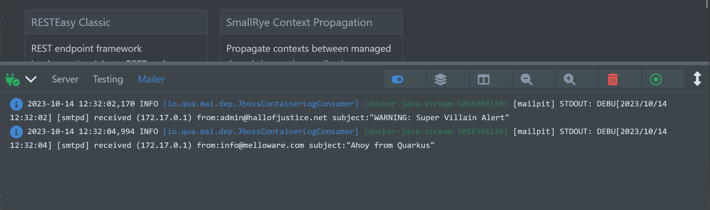

<div align="center">


# Quarkus Mailpit
</div>
<br>

[](https://search.maven.org/artifact/io.quarkiverse.mailpit/quarkus-mailpit)
[](https://opensource.org/licenses/Apache-2.0)
[](https://github.com/quarkiverse/quarkus-mailpit/actions/workflows/build.yml)

<!-- ALL-CONTRIBUTORS-BADGE:START - Do not remove or modify this section -->
[](#contributors-)
<!-- ALL-CONTRIBUTORS-BADGE:END -->

A Quarkus extension that lets you utilize [Mailpit](https://github.com/axllent/mailpit) as a [DevService](https://quarkus.io/guides/dev-services) for the Quarkus Mailer enabling zero-config SMTP for testing or running in dev mode.  Mailpit acts as an SMTP server, provides a modern web interface to view & test captured emails, and contains an API for automated integration testing.

Using this service has some obvious advantages when running in dev mode including but not limited to:

* Verify e-mail and their content without a real mail server
* Prevent accidentally sending a customer an email while developing
* Use the REST API to verify contents of real send emails and not mocked mail
* [12 Factor App: Backing services](https://12factor.net/backing-services) Treat backing services as attached resources
* [12 Factor App: Dev/Prod Parity](https://12factor.net/dev-prod-parity) Keep development and production as similar as possible 

## Getting started

Read the full [Mailpit documentation](https://docs.quarkiverse.io/quarkus-mailpit/dev/index.html).

### Prerequisite

- Create or use an existing Quarkus application which uses Mailer
- Add the Mailpit extension

### Installation

Create a new mailpit project (with a base mailpit starter code):

- With [code.quarkus.io](https://code.quarkus.io/?a=mailpit-bowl&j=17&e=io.quarkiverse.mailpit%3Aquarkus-mailpit)
- With the [Quarkus CLI](https://quarkus.io/guides/cli-tooling):

```bash
quarkus create app mailpit-app -x=io.quarkiverse.mailpit:quarkus-mailpit
```
Or add to you pom.xml directly:

```xml
<dependency>
    <groupId>io.quarkiverse.mailpit</groupId>
    <artifactId>quarkus-mailpit</artifactId>
    <version>{project-version}</version>
</dependency>

<!-- If you want to use test framework to verify emails also -->
<dependency>
   <groupId>io.quarkiverse.mailpit</groupId>
   <artifactId>quarkus-mailpit-testing</artifactId>
   <version>{project-version}</version>
   <scope>test</scope>
</dependency>
```

## Usage

Now that you configured your POM to use the service, now you need to tell your dev mode to send emails to Mailpit by modifying the following properties in your `application.properties`:

```properties
%dev.quarkus.mailer.host=localhost
%dev.quarkus.mailer.port=1025
%dev.quarkus.mailer.mock=false # In dev mode, prevent from using the mock SMTP server
```

This will enable the Mailer to send real e-mails that will be intercepted by Mailpit.  Next, add some code that sends an e-mail...

```java
@Path("/superheroes")
@ApplicationScoped
public class SuperheroResource {
    @Inject
    Mailer mailer;

    @GET
    public String villainAlert() {
        Mail m = new Mail();
        m.setFrom("admin@hallofjustice.net");
        m.setTo(List.of("superheroes@quarkus.io"));
        m.setSubject("WARNING: Super Villain Alert");
        m.setText("Lex Luthor has been seen in Gotham City!");
        mailer.send(m);

        return "Superheroes alerted!";
    }
}
```

Then inspect your e-mails from your running application in the Dev UI:


## Logging

You can view all of Mailpit's container logs right in the DevUI log area to debug all messages and errors from Mailpit.



## Testing

Running your integration tests you can inspect the results of any mail capture by Mailpit using our test framework.  For example to test the example email above the test would look like this:

```java
@QuarkusTest
@WithMailbox
public class MailpitResourceTest {

    @InjectMailbox
    Mailbox mailbox;

    @AfterEach
    public void afterEach() throws ApiException {
        // clear the mailbox after each test run if you prefer
        mailbox.clear();
    }

    @Test
    public void testAlert() throws ApiException {
        given()
                .when().get("/mailpit/alert")
                .then()
                .statusCode(200)
                .body(is("Superheroes alerted!!"));

        // look up the mail and assert it
        Message message = mailbox.findFirst("admin@hallofjustice.net");
        assertThat(message, notNullValue());
        assertThat(message.getTo().get(0).getAddress(), is("superheroes@quarkus.io"));
        assertThat(message.getSubject(), is("WARNING: Super Villain Alert"));
        assertThat(message.getText(), is("Lex Luthor has been seen in Gotham City!\r\n"));
    }
}
```

## 🧑‍💻 Contributing

- Contribution is the best way to support and get involved in community!
- Please, consult our [Code of Conduct](./CODE_OF_CONDUCT.md) policies for interacting in our community.
- Contributions to `quarkus-mailpit` Please check our [CONTRIBUTING.md](./CONTRIBUTING.md)

### If you have any idea or question 🤷

- [Ask a question](https://github.com/quarkiverse/quarkus-mailpit/discussions)
- [Raise an issue](https://github.com/quarkiverse/quarkus-mailpit/issues)
- [Feature request](https://github.com/quarkiverse/quarkus-mailpit/issues)
- [Code submission](https://github.com/quarkiverse/quarkus-mailpit/pulls)

## Contributors ✨

Thanks goes to these wonderful people ([emoji key](https://allcontributors.org/docs/en/emoji-key)):
<!-- ALL-CONTRIBUTORS-LIST:START - Do not remove or modify this section -->
<!-- prettier-ignore-start -->
<!-- markdownlint-disable -->
<table>
  <tbody>
    <tr>
      <td align="center" valign="top" width="14.28%"><a href="http://melloware.com"><br /><sub><b>Melloware</b></sub></a><br /><a href="https://github.com/quarkiverse/quarkus-mailpit/commits?author=melloware" title="Code">💻</a> <a href="#maintenance-melloware" title="Maintenance">🚧</a></td>
      <td align="center" valign="top" width="14.28%"><a href="https://github.com/tmulle"><br /><sub><b>tmulle</b></sub></a><br /><a href="https://github.com/quarkiverse/quarkus-mailpit/commits?author=tmulle" title="Tests">⚠️</a></td>
      <td align="center" valign="top" width="14.28%"><a href="https://github.com/wansors"><br /><sub><b>wansors</b></sub></a><br /><a href="https://github.com/quarkiverse/quarkus-mailpit/issues?q=author%3Awansors" title="Bug reports">🐛</a></td>
      <td align="center" valign="top" width="14.28%"><a href="http://gastaldi.wordpress.com"><br /><sub><b>George Gastaldi</b></sub></a><br /><a href="https://github.com/quarkiverse/quarkus-mailpit/issues?q=author%3Agastaldi" title="Bug reports">🐛</a> <a href="https://github.com/quarkiverse/quarkus-mailpit/commits?author=gastaldi" title="Tests">⚠️</a></td>
    </tr>
  </tbody>
</table>

<!-- markdownlint-restore -->
<!-- prettier-ignore-end -->

<!-- ALL-CONTRIBUTORS-LIST:END -->