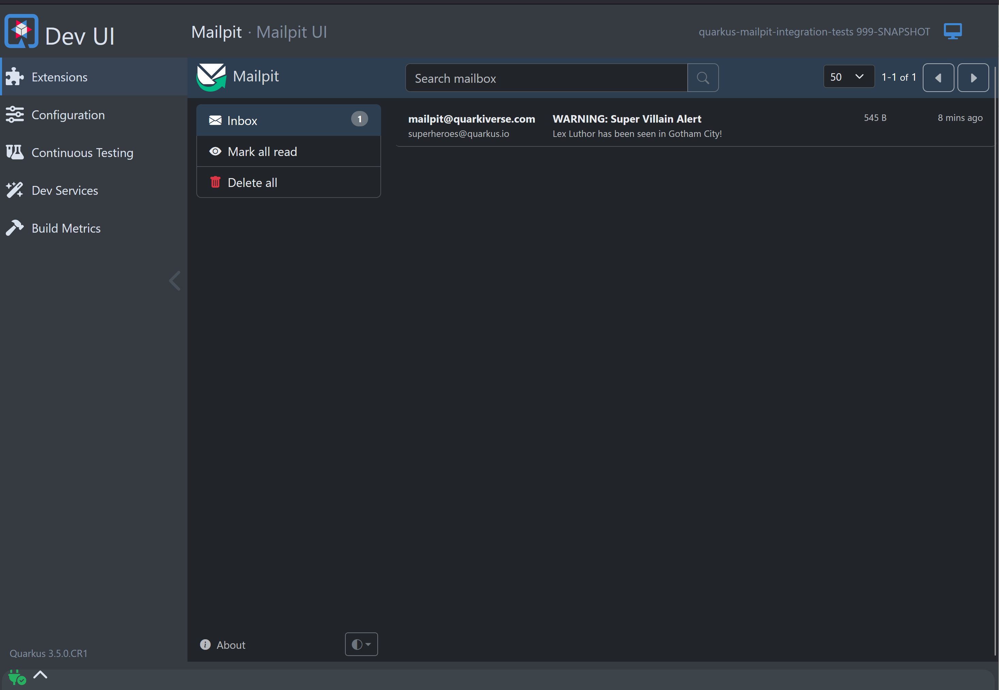

<div align="center">


# Quarkus Mailpit
</div>
<br>

[](https://search.maven.org/artifact/io.quarkiverse.mailpit/quarkus-mailpit)


A Quarkus extension that lets you utilize [Mailpit](https://github.com/axllent/mailpit) as a Dev Service for the Quarkus Mailer.  Mailpit acts as an SMTP server, provides a modern web interface to view & test captured emails, and contains an API for automated integration testing.

Using this service has some obvious advantages when running in dev mode including but not limited to:

* Verify e-mail and their content without a real mail server
* Prevent accidentally sending a customer an email while developing
* Use the REST API to verify contents of real send emails and not mocked mail

## Getting started

Read the full [Mailpit documentation](https://docs.quarkiverse.io/quarkus-mailpit/dev/index.html).

### Prerequisite

- Create or use an existing Quarkus application which uses Mailer
- Add the Mailpit extension

### Installation

Create a new mailpit project (with a base mailpit starter code):

- With [code.quarkus.io](https://code.quarkus.io/?a=mailpit-bowl&j=17&e=io.quarkiverse.mailpit%3Aquarkus-mailpit)
- With the [Quarkus CLI](https://quarkus.io/guides/cli-tooling):

```bash
quarkus create app mailpit-app -x=io.quarkiverse.mailpit:quarkus-mailpit
```
Or add to you pom.xml directly:

```xml
<dependency>
    <groupId>io.quarkiverse.mailpit</groupId>
    <artifactId>quarkus-mailpit</artifactId>
    <version>{project-version}</version>
</dependency>
```

## Usage

Now that you configured your POM to use the service, now you need to tell your dev mode to send emails to Mailpit by modifying the following properties in your `application.properties`:

```properties
%dev.quarkus.mailer.host=localhost
%dev.quarkus.mailer.port=1025
%dev.quarkus.mailer.mock=false
```

This will enable the Mailer to send real e-mails that will be intercepted by Mailpit.  Next, add some code that sends an e-mail...

```java
@Path("/superheroes")
@ApplicationScoped
public class SuperheroResource {
    @Inject
    Mailer mailer;

    @GET
    public String villainAlert() {
        mailer.send(Mail.withText("superheroes@quarkus.io",
                "WARNING: Super Villain Alert",
                "Lex Luthor has been seen in Gotham City!"));

        return "Email sent!";
    }
}
```

Then inspect your e-mails from your running application in the Dev UI:



## 🧑‍💻 Contributing

- Contribution is the best way to support and get involved in community!
- Please, consult our [Code of Conduct](./CODE_OF_CONDUCT.md) policies for interacting in our community.
- Contributions to `quarkus-mailpit` Please check our [CONTRIBUTING.md](./CONTRIBUTING.md)

### If you have any idea or question 🤷

- [Ask a question](https://github.com/quarkiverse/quarkus-mailpit/discussions)
- [Raise an issue](https://github.com/quarkiverse/quarkus-mailpit/issues)
- [Feature request](https://github.com/quarkiverse/quarkus-mailpit/issues)
- [Code submission](https://github.com/quarkiverse/quarkus-mailpit/pulls)

## Contributors ✨

Thanks goes to these wonderful people ([emoji key](https://allcontributors.org/docs/en/emoji-key)):